## Sommaire

1. [Vue d'ensemble de l'architecture](#1-vue-densemble-de-larchitecture)
2. [Flux d'authentification](#2-flux-dauthentification)
3. [Flux — Enregistrement vocal](#3-flux--enregistrement-vocal)
4. [Flux — Chatbot IA (streaming)](#4-flux--chatbot-ia-streaming)
5. [Flux — Flashcards & algorithme SRS](#5-flux--flashcards--algorithme-srs)
6. [Flux — Dictionnaire & Traducteur](#6-flux--dictionnaire--traducteur)
7. [Flux — Notifications push](#7-flux--notifications-push)
8. [Flux — Partage social (V2)](#8-flux--partage-social-v2)
9. [Communication inter-services](#9-communication-inter-services)
10. [Légende des protocoles](#10-l%C3%A9gende-des-protocoles)

---

## 1. Vue d'ensemble de l'architecture

Tous les services tournent dans le même réseau Docker interne. Traefik est le seul point d'entrée exposé publiquement — il route les requêtes vers le bon service selon le path de l'URL.

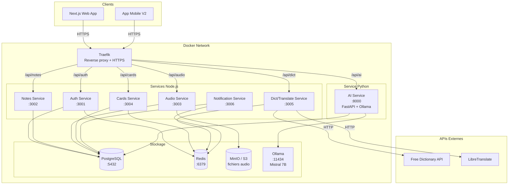

---

## 2. Flux d'authentification

L'auth utilise un double token : un JWT court (15 min) pour les requêtes API, et un refresh token long (7 jours) en cookie HttpOnly pour renouveler le JWT sans redemander le mot de passe.

### 2.1 Inscription / Connexion

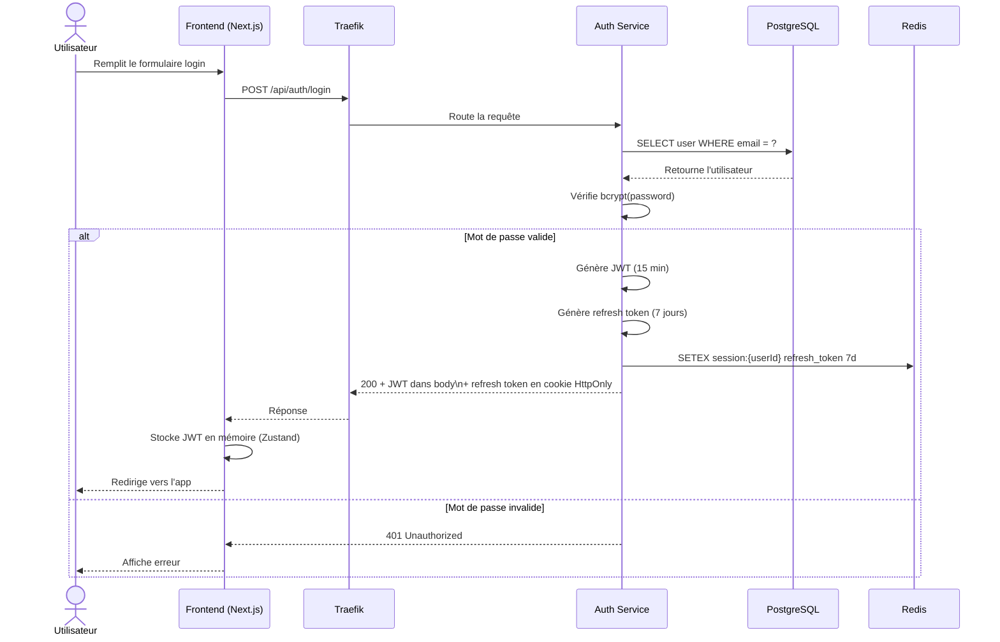

### 2.2 Renouvellement du JWT (refresh)

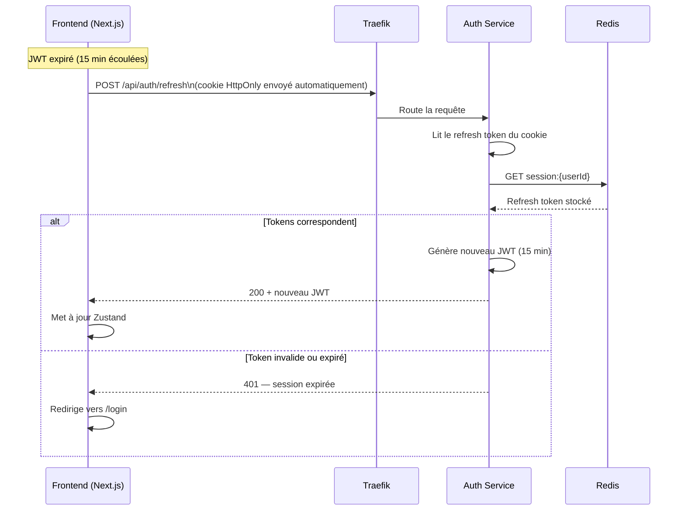

### 2.3 Middleware d'authentification sur chaque service

Chaque service Node.js applique ce middleware sur toutes ses routes protégées.

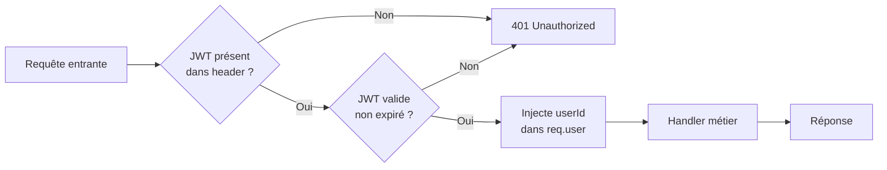

---

## 3. Flux — Enregistrement vocal

Le flux audio est en deux temps : upload immédiat après l'enregistrement, puis lecture via URL signée.

### 3.1 Enregistrement et upload

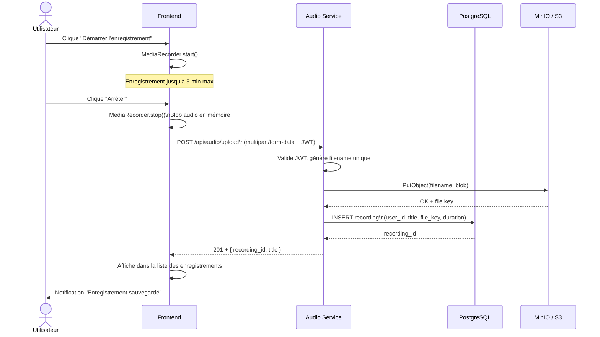

### 3.2 Réécoute (session du soir)

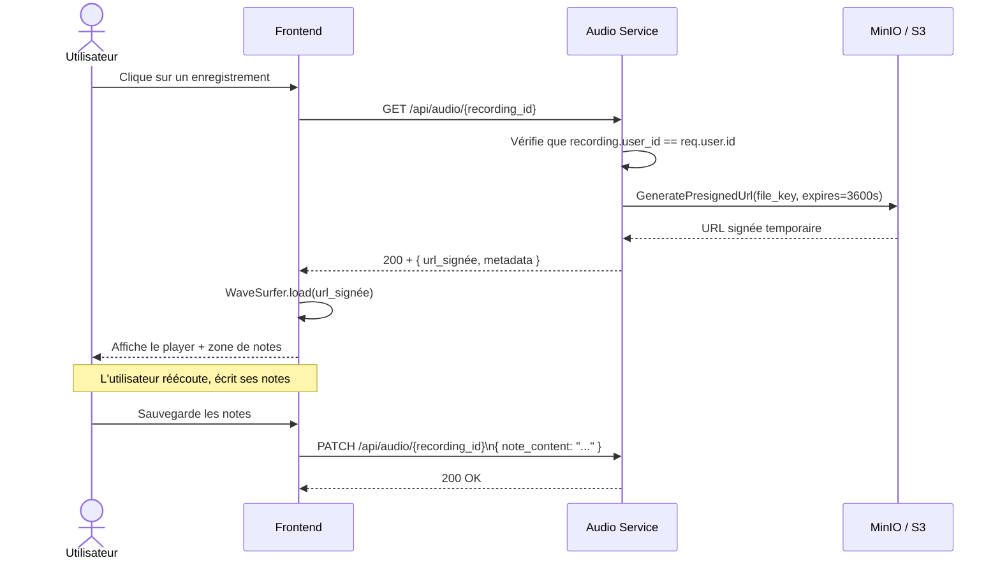

---

## 4. Flux — Chatbot IA (streaming)

Le point le plus technique de l'app. La réponse de l'IA arrive token par token via SSE (Server-Sent Events), ce qui donne l'effet "frappe en direct".

### 4.1 Message simple

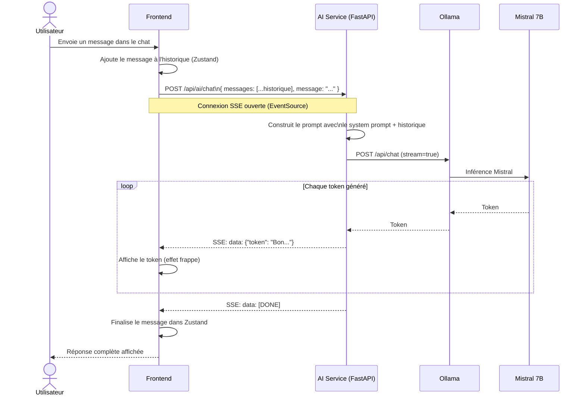

### 4.2 Raccourci contextuel — "Analyser cette note"

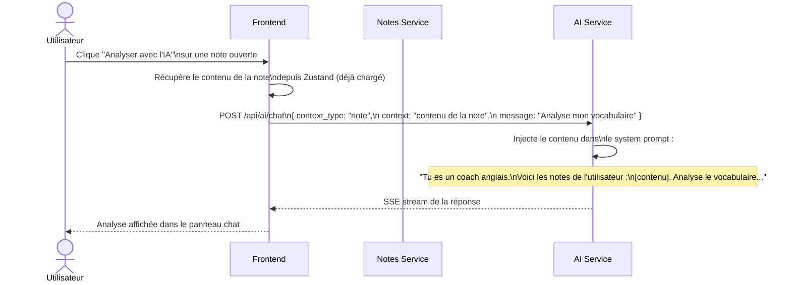

### 4.3 Génération d'un deck de flashcards par l'IA

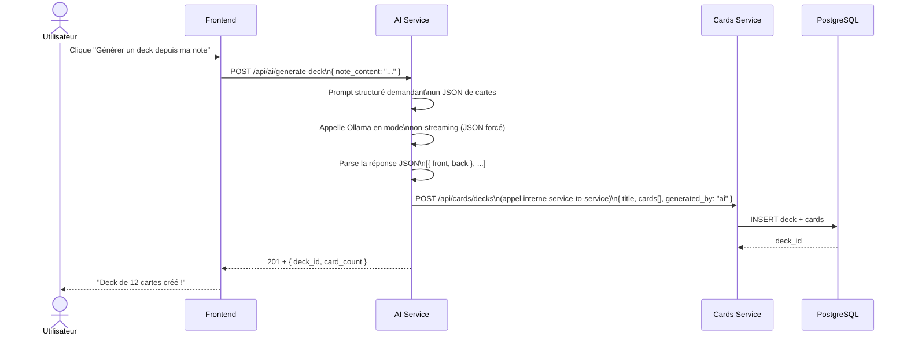

---

## 5. Flux — Flashcards & algorithme SRS

L'algorithme FSRS calcule la prochaine date de révision en fonction de la note donnée (1 à 4) et de l'historique de la carte.

### 5.1 Session de révision

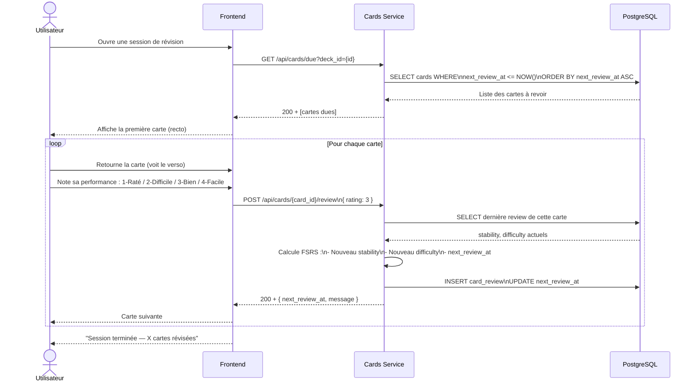

---

## 6. Flux — Dictionnaire & Traducteur

Ces services sont de simples proxies vers des APIs externes, avec un cache Redis pour éviter les requêtes redondantes.

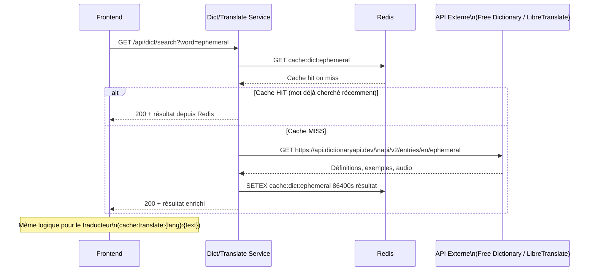

---

## 7. Flux — Notifications push

Un cron job tourne chaque jour dans le service de notifications et envoie deux rappels : le matin pour enregistrer, le soir pour réécouter.

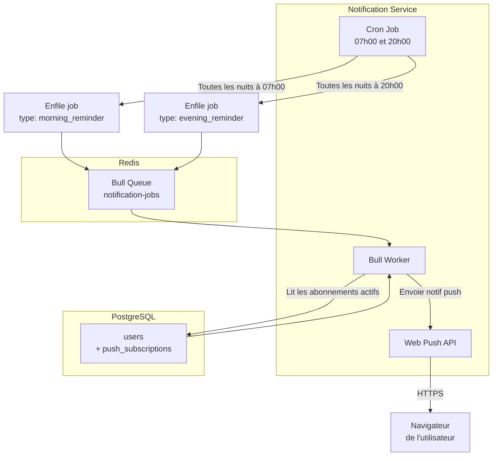

---

## 8. Flux — Partage social (V2)

Le partage se fait en mode "push" : l'expéditeur envoie un item, le destinataire le reçoit dans une boîte de réception.

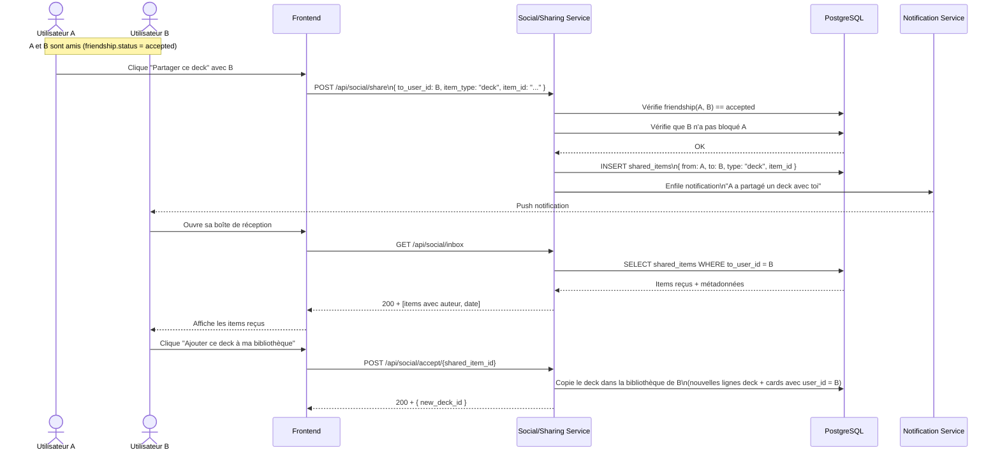

---

## 9. Communication inter-services

### 9.1 Règles de communication

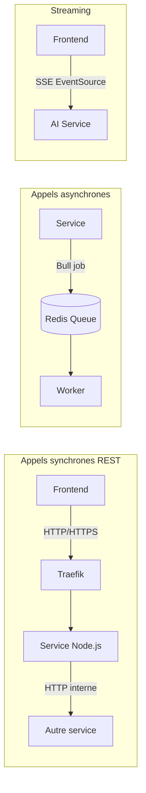

### 9.2 Matrice de communication complète

| Service émetteur | Service destinataire | Protocole         | Cas d'usage                          |
| ---------------- | -------------------- | ----------------- | ------------------------------------ |
| Frontend         | Tous les services    | HTTPS via Traefik | Toutes les requêtes utilisateur      |
| Auth Service     | PostgreSQL           | TCP (Prisma)      | Lecture/écriture utilisateurs        |
| Auth Service     | Redis                | TCP               | Stockage sessions & refresh tokens   |
| Notes Service    | PostgreSQL           | TCP (Prisma)      | CRUD notes et cahiers                |
| Audio Service    | PostgreSQL           | TCP (Prisma)      | Métadonnées enregistrements          |
| Audio Service    | MinIO/S3             | HTTP (AWS SDK)    | Upload et presigned URLs             |
| Cards Service    | PostgreSQL           | TCP (Prisma)      | Decks, cartes, reviews FSRS          |
| Cards Service    | Redis                | TCP               | Cache decks fréquents                |
| Dict Service     | Redis                | TCP               | Cache résultats dictionnaire         |
| Dict Service     | Free Dictionary API  | HTTPS externe     | Recherche de mots                    |
| Dict Service     | LibreTranslate       | HTTPS externe     | Traductions                          |
| AI Service       | Ollama               | HTTP local        | Inférence Mistral (streaming)        |
| AI Service       | Cards Service        | HTTP interne      | Création de decks générés par IA     |
| AI Service       | PostgreSQL           | TCP               | Historique conversations (optionnel) |
| Notif Service    | Redis/Bull           | TCP               | File d'attente des notifications     |
| Notif Service    | PostgreSQL           | TCP (Prisma)      | Récupération abonnements push        |

### 9.3 Gestion des erreurs inter-services

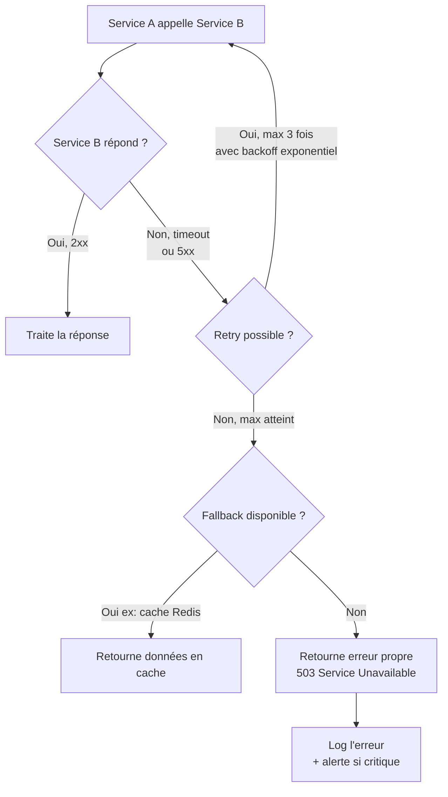

---

## 10. Légende des protocoles

| Protocole          | Usage dans Replang                    | Sens                    |
| ------------------ | ------------------------------------- | ----------------------- |
| **HTTPS**          | Toutes les requêtes clients → Traefik | Client → Serveur        |
| **HTTP interne**   | Communication entre services Docker   | Service → Service       |
| **TCP (Prisma)**   | Services → PostgreSQL                 | Service → BDD           |
| **TCP (ioredis)**  | Services → Redis                      | Service → Cache         |
| **HTTP (AWS SDK)** | Audio Service → MinIO/S3              | Service → Stockage      |
| **SSE**            | Frontend → AI Service (streaming IA)  | Serveur → Client (push) |
| **Web Push**       | Notification Service → Navigateur     | Serveur → Client (push) |
| **HTTP local**     | AI Service → Ollama                   | Interne conteneur IA    |

---

> **Note :** Tous les appels HTTP internes (service-to-service) se font sur le réseau Docker privé, sans passer par Traefik. Ils ne sont jamais exposés à l'extérieur. Seul Traefik est accessible depuis internet (ports 80 et 443).
