> **Source de vérité** : ce diagramme reflète `packages/db/prisma/schema.prisma`.
> L'authentification est gérée par **Better-Auth** (tables `users`, `sessions`,
> `accounts`, `verifications`). Les rôles sont en table (`roles` + `user_roles`).

```mermaid
erDiagram

  %% ─── AUTH (Better-Auth) ──────────────────────────────────────

  users {
    string   id            PK
    string   name
    string   email         UK
    boolean  emailVerified
    string   image
    string   displayName   "champ métier"
    json     settings      "champ métier"
    datetime created_at
    datetime updated_at
  }

  sessions {
    string   id            PK
    string   token         UK
    datetime expires_at
    string   ip_address
    string   user_agent
    string   user_id       FK
    datetime created_at
    datetime updated_at
  }

  accounts {
    string   id            PK
    string   account_id
    string   provider_id
    string   user_id       FK
    string   password      "hash si login email/mdp"
    string   access_token
    string   refresh_token
    datetime created_at
    datetime updated_at
  }

  verifications {
    string   id          PK
    string   identifier
    string   value
    datetime expires_at
    datetime created_at
    datetime updated_at
  }

  %% ─── RÔLES ───────────────────────────────────────────────────

  roles {
    uuid     id          PK
    string   name        UK "admin | user | ia | note …"
    string   description
    datetime created_at
  }

  user_roles {
    string   user_id     PK,FK
    uuid     role_id     PK,FK
    datetime assigned_at
  }

  %% ─── AUDIO ───────────────────────────────────────────────────

  recordings {
    uuid     id               PK
    string   user_id          FK
    string   title
    string   file_key         "clé objet S3/MinIO"
    int      duration_seconds
    text     note_content
    datetime recorded_at
    datetime created_at
  }

  %% ─── NOTES ───────────────────────────────────────────────────

  notebooks {
    uuid     id         PK
    string   user_id    FK
    string   title
    int      position
    datetime created_at
  }

  notes {
    uuid     id          PK
    string   user_id     FK
    uuid     notebook_id FK "null = note rapide"
    string   title
    json     content     "document TipTap"
    datetime updated_at
    datetime created_at
  }

  %% ─── FLASHCARDS ──────────────────────────────────────────────

  decks {
    uuid     id           PK
    string   user_id      FK
    string   title
    boolean  is_public
    enum     generated_by "user | ai"
    datetime created_at
  }

  cards {
    uuid     id        PK
    uuid     deck_id   FK
    text     front
    text     back
    datetime created_at
  }

  card_reviews {
    uuid     id             PK
    uuid     card_id        FK
    string   user_id        FK
    int      rating         "1=Again 2=Hard 3=Good 4=Easy"
    float    stability      "FSRS"
    float    difficulty     "FSRS"
    datetime next_review_at
    datetime reviewed_at
  }

  %% ─── NOTIFICATIONS ───────────────────────────────────────────

  push_subscriptions {
    uuid     id        PK
    string   user_id   FK
    string   endpoint  UK
    string   p256dh
    string   auth
    datetime created_at
  }

  %% ─── SOCIAL V2 ───────────────────────────────────────────────

  friendships {
    uuid     id           PK
    string   requester_id FK
    string   addressee_id FK
    enum     status       "pending | accepted | rejected"
    datetime created_at
  }

  shared_items {
    uuid     id           PK
    string   from_user_id FK
    string   to_user_id   FK
    enum     item_type    "deck | note"
    uuid     item_id      "polymorphe, sans FK"
    datetime created_at
  }

  blocks {
    uuid     id         PK
    string   blocker_id FK
    string   blocked_id FK
    datetime created_at
  }

  reports {
    uuid     id               PK
    string   reporter_id      FK
    string   reported_user_id FK
    string   reason
    enum     status           "pending | reviewed | dismissed"
    datetime created_at
  }

  %% ─── RELATIONS ───────────────────────────────────────────────

  users          ||--o{ sessions           : "a"
  users          ||--o{ accounts           : "a"
  users          ||--o{ user_roles         : "possède"
  roles          ||--o{ user_roles         : "attribué via"

  users          ||--o{ recordings         : "crée"
  users          ||--o{ notebooks          : "possède"
  users          ||--o{ notes              : "écrit"
  users          ||--o{ decks              : "crée"
  users          ||--o{ card_reviews       : "effectue"
  users          ||--o{ push_subscriptions : "enregistre"
  users          ||--o{ friendships        : "initie"
  users          ||--o{ shared_items       : "partage"
  users          ||--o{ blocks             : "bloque"
  users          ||--o{ reports            : "signale"

  notebooks      ||--o{ notes              : "contient"
  decks          ||--o{ cards              : "contient"
  cards          ||--o{ card_reviews       : "reçoit"
```

---

## Notes de conception

- **Auth = Better-Auth.** Les tables `users`, `sessions`, `accounts`, `verifications` suivent les conventions de Better-Auth. La table `accounts` stocke le hash du mot de passe (login email/mdp) **et** les comptes OAuth éventuels. Plus de table `sessions` « maison » avec refresh token : Better-Auth gère sessions et tokens.
- **`users.id` est un `string`** (généré par Better-Auth), pas un `uuid` natif. Les tables métier référencent donc `user_id` en `string`. Les tables purement métier gardent un `uuid` en PK.
- **Rôles en table, pas en enum.** `roles` + `user_roles` (jonction many-to-many) permettent d'ajouter/retirer un rôle sans migration de schéma. Un utilisateur peut cumuler plusieurs rôles. Rôles initiaux semés : `admin`, `user`, `ia`, `note` (à affiner).
- **`notes.notebook_id` est nullable** : `null` = note rapide globale, `uuid` = appartient à un cahier.
- **`card_reviews` stocke un enregistrement par révision**, pas l'état courant. L'état FSRS actuel d'une carte = dernière ligne `WHERE card_id = ? AND user_id = ? ORDER BY reviewed_at DESC LIMIT 1`.
- **`recordings.file_key`** stocke la clé de l'objet S3/MinIO (et non une URL) ; l'URL signée est générée à la volée à chaque lecture.
- **`push_subscriptions`** stocke les abonnements Web Push (endpoint + clés p256dh/auth) nécessaires au service de notifications.
- **`shared_items.item_id`** est une relation polymorphique non contrainte par FK — la cohérence est assurée côté applicatif selon `item_type`.
- Les tables `blocks` et `reports` sont marquées V2 mais sont migrées dès le départ sans impact sur le reste du schéma.
